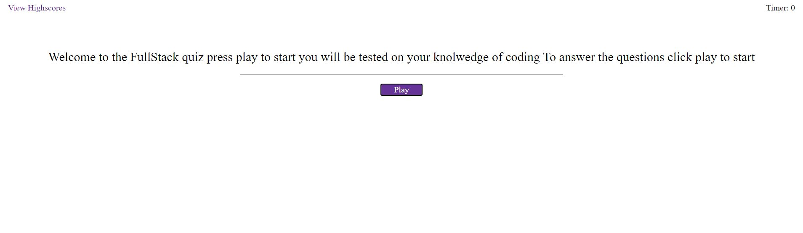
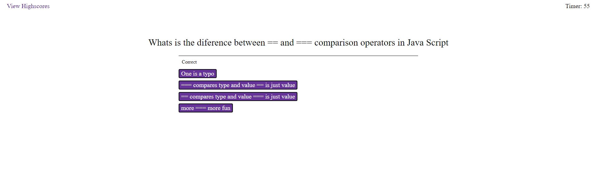
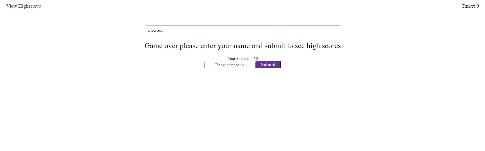

# Coding Quiz Project

## Table of contents
* [Aim](#Aim)
* [Challenges](#Challenges)
* [Prerequisites](#Prerequisites)
* [Pictures](#Pictures)

# General info :

## Built With:

* HTML
* Css
* reset.css (Link in recources)
* Visual Studio Code

## Aim :

This project was Bootcamp Challenge to design a coding Quiz that test your knowledge of JS CSS HTML 
The quiz is timed 
This was written by me and only me 

## Prerequisites :

Can be opened in any text editor workspace
Please use google Chrome for optimum results
## Example
* Visual studio code
* notepad++

## Challenges

This was my first time using local storage, i learned alot about how it is stored and accessing the variables. I was struggling with pushing items to the local storage until i relised , I needed to retrieve them first before pushing additional values.

I leared alot about local storage and am now quite profficent with it.

## Pictures :

#### Git hub
https://github.com/ChrisOnions/Coding_Quiz
#### Deployed link
https://chrisonions.github.io/Coding_Quiz/
